# 🚀 Hey there, I'm [Shrey Sharma]! 
### *Final Year Student | Aspiring ML Engineer | AI Agent Enthusiast*

<div align="center">


[](https://git.io/typing-svg)

</div>

---

## 🌟 About Me

```python
class AspiringMLEngineer:
    def __init__(self):
        self.name = "Your Name"
        self.status = "Final Year Student"
        self.degree = "Computer Science / Engineering"  # Update with your degree
        self.location = "🌍 India"
        self.passion = ["Real-World ML Applications", "AI Agents", "Scalable Systems"]
        self.current_learning = ["MLOps", "Cloud Architecture", "Vector Databases"]
        self.goal = "Building production-ready ML systems that solve real problems"
        
    def my_mission(self):
        return "Turning academic knowledge into scalable, real-world AI solutions 🚀"

me = AspiringMLEngineer()
print(me.my_mission())
```

🎓 **Who I Am:**
- 📚 **Final Year Student** passionate about Machine Learning and AI
- 🎯 **Aspiring ML Engineer** focused on building real-world, scalable applications
- 🤖 **AI Agent Enthusiast** exploring multi-agent systems and intelligent automation
- 🏗️ **Cloud Learner** diving deep into AWS, MLOps, and serverless architectures
- 💡 **Problem Solver** who loves turning complex ideas into working solutions

🚀 **What I'm Building:**
- 🔍 **Real-Time ML Systems** - Fraud detection, recommendation engines, predictive analytics
- 🤖 **Intelligent AI Agents** - Multi-agent workflows, RAG systems, autonomous problem-solving
- ⚡ **Scalable Applications** - Cloud-native solutions that can handle production workloads
- 🧠 **End-to-End Pipelines** - From data collection to model deployment and monitoring

---

## 🛠️ Tech Arsenal

<div align="center">

### 💻 **Core Programming**


### 🤖 **Machine Learning & AI**


### 🧠 **AI Agents & LLMs**


### ☁️ **Cloud & MLOps**


### 📊 **Data & Vector Databases**


### 🔧 **Development Tools**


</div>

---

## 📊 GitHub Analytics

<div align="center">


</div>

---

## 🏆 My Projects

<div align="center">

### 🚀 **Real-Time Fraud Detection Platform**
[](https://github.com/ShreySharma07/aws-realtime-fraud-detection)

**Tech Stack:** `AWS SageMaker` `Lambda` `XGBoost` `CDK` `Docker`

*End-to-end serverless ML pipeline for real-time fraud detection with professional MLOps practices*

---

### 🤖 **[Add Your AI Agent Project]**
*Want to showcase another project? Replace this with your actual repo:*
```markdown
[](https://github.com/YourUsername/your-ai-project)
```

---

### 🧠 **[Add Your ML Project]**
*Got another cool ML project? Add it here:*
```markdown
[](https://github.com/YourUsername/your-ml-project)
```

**💡 Pro Tip:** Replace the placeholder sections above with your actual repositories!

</div>

---

## 🎯 Current Learning & Goals

```mermaid
graph TD
    A[🎓 Academic Foundation] --> B[Real-World Applications]
    
    C[🤖 AI Agents] --> D[Multi-Agent Systems]
    C --> E[LangChain & AutoGen]
    C --> F[Intelligent Automation]
    
    G[⚡ Scalable ML] --> H[MLOps Pipelines]
    G --> I[Cloud Deployment]
    G --> J[Production Systems]
    
    K[🧠 Advanced ML] --> L[Deep Learning]
    K --> M[Vector Databases]
    K --> N[RAG Systems]
    
    B --> O[🚀 Career Goals]
    F --> O
    J --> O
    N --> O
    
    O --> P[ML Engineer Role]
    O --> Q[AI Product Builder]
    O --> R[Tech Innovator]
```



### 🎯 **2024 Goals:**
- 🏗️ **Build 3-5 production-ready ML projects** with real-world impact
- 🤖 **Master AI Agent frameworks** like LangChain, AutoGen, and CrewAI  
- ☁️ **Get AWS/GCP certified** in ML and cloud architecture
- 🚀 **Land my first ML Engineering role** at a forward-thinking company
- 📚 **Contribute to open-source** ML/AI projects

### 🌱 **Currently Learning:**
- **MLOps:** CI/CD for ML, model monitoring, A/B testing
- **Vector Databases:** Pinecone, Weaviate, ChromaDB for RAG systems
- **Cloud Architecture:** AWS SageMaker, Lambda, containerization
- **AI Agents:** Multi-agent workflows, tool integration, reasoning systems

---

## 🌐 Let's Connect!

<div align="center">

[](https://linkedin.com/in/yourprofile)
[](https://twitter.com/yourhandle)
[](https://medium.com/@yourhandle)
[](https://yourportfolio.com)

**💬 Open to collaborating on:**
- 🤖 **AI Agent Projects** - Multi-agent systems, RAG applications
- ⚡ **Real-Time ML Systems** - Fraud detection, recommendation engines
- 🏗️ **MLOps Projects** - CI/CD for ML, model deployment pipelines
- 🧠 **Open Source Contributions** - ML libraries, AI frameworks
- 🎓 **Student Projects** - Hackathons, research collaborations

**🎯 Looking for:**
- 🚀 **Internship opportunities** in ML/AI engineering
- 🤝 **Mentorship** from experienced ML engineers
- 💡 **Project collaboration** with fellow students and developers
- 📚 **Learning opportunities** in production ML systems

</div>

---

## 🎨 Fun Facts About Me

- 🎓 **Final year student** who codes more than I sleep (and that's saying something!)
- 🧠 I think in **Python** and dream about **neural network architectures**
- ⚡ I can debug a model faster than I can decide what to order for dinner
- 🤖 I'm convinced **AI agents** will change everything (and I want to be part of it!)
- 📊 My browser bookmarks are 90% **ML papers** and **GitHub repos**
- 🚀 I've built more **proof-of-concepts** than I have working deployment scripts (working on that!)
- 🎯 My ultimate goal: **Build AI that actually helps people solve real problems**

---

<div align="center">


### 🚀 *"Building the future, one algorithm at a time"*

**⭐ Star my repos if you find them helpful!** 


</div>
